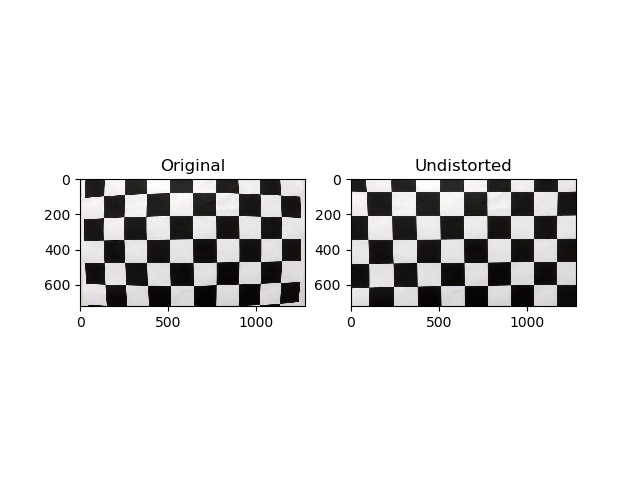
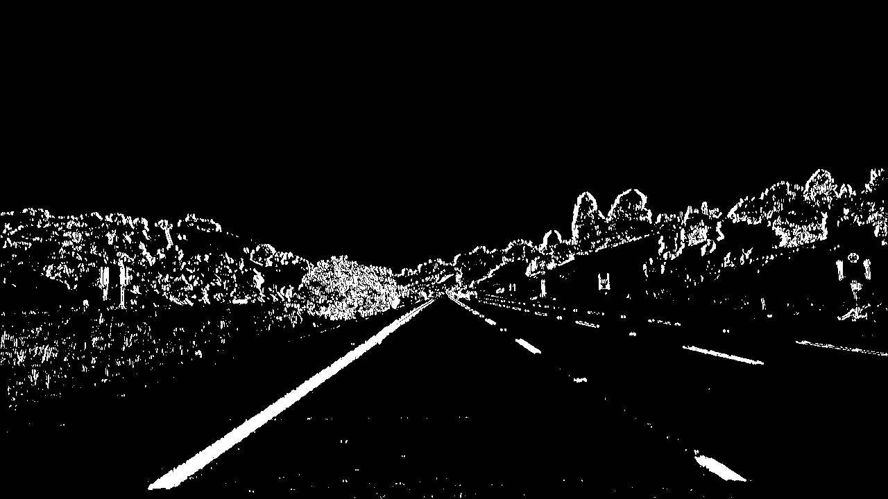
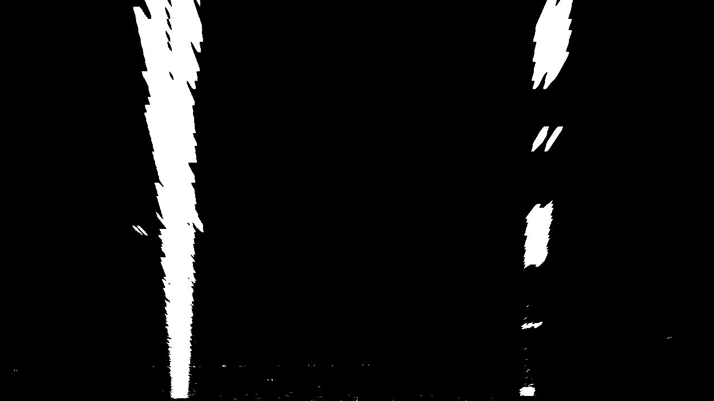
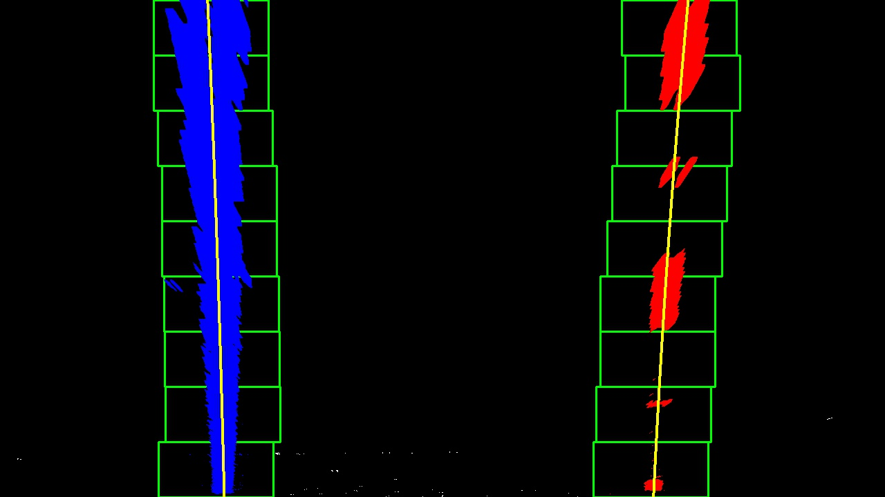

## Writeup Template

### You can use this file as a template for your writeup if you want to submit it as a markdown file, but feel free to use some other method and submit a pdf if you prefer.

---

**Advanced Lane Finding Project**

The goals / steps of this project are the following:

* Compute the camera calibration matrix and distortion coefficients
given a set of chessboard images.
* Apply a distortion correction to raw images.
* Use color transforms, gradients, etc., to create a thresholded binary
image.
* Apply a perspective transform to rectify binary image ("birds-eye view").
* Detect lane pixels and fit to find the lane boundary.
* Determine the curvature of the lane and vehicle position with respect
to center.
* Warp the detected lane boundaries back onto the original image.
* Output visual display of the lane boundaries and numerical estimation
of lane curvature and vehicle position.

[//]: # (Image References)

[image1]: ./examples/undistort_output.png "Undistorted"
[image2]: ./test_images/test1.jpg "Road Transformed"
[image3]: ./examples/binary_combo_example.jpg "Binary Example"
[image4]: ./examples/warped_straight_lines.jpg "Warp Example"
[image5]: ./examples/color_fit_lines.jpg "Fit Visual"
[image6]: ./examples/example_output.jpg "Output"
[video1]: ./project_video.mp4 "Video"

## [Rubric](https://review.udacity.com/#!/rubrics/571/view) Points

### Here I will consider the rubric points individually and describe how I addressed each point in my implementation.  

---

### Writeup / README

#### 1. Provide a Writeup / README that includes all the rubric points and how you addressed each one.  You can submit your writeup as markdown or pdf.  [Here](https://github.com/udacity/CarND-Advanced-Lane-Lines/blob/master/writeup_template.md) is a template writeup for this project you can use as a guide and a starting point.  

You're reading it!

**Please note** all the code for this project is included inside the
`code` directory. The entry point for the scrip is the `main.py` file.
Launching it will start processing all the images and all the videos.
Processed images and videos are outputted and overwrite existing files
inside the `output_images` folder.


### Camera Calibration

#### 1. Briefly state how you computed the camera matrix and distortion coefficients. Provide an example of a distortion corrected calibration image.

The code for this step is contained in the file called
`./code/calibration.py`.

The `calibrate_camera` function will extract all the chessboard corners
from all the provided images inside the `camera_cal` folder.
OpenCV's `calibrateCamera` function was used to obtain the calibration
parameters for the camera.

Once computed, these parameters are saved and stored for later usage.
A function called `get_calibration` will create the calibration params
if they are missing and store them in the `camera_cal` folder.

Inside the `output_images` folder a new folder called `camera_cal` was
created containing the output of the calibration.



Please look inside the `output_images/camera_cal` folder for further
details.


### Pipeline (single images)

#### 1. Provide an example of a distortion-corrected image.

After applying the undistortion correction the following results are
obtained:

**Original image**


**Undistorted**


Further examples can be found in the `output_images` directory, have
a look at all files ending with **`_1_undistorted.jpg`**.


#### 2. Describe how (and identify where in your code) you used color transforms, gradients or other methods to create a thresholded binary image.  Provide an example of a binary image result.

The code for this part can be found inside the file `code\binarize.py`.

I used a combination between:

- the absolute sobel in the X direction
applied to the S channel after converting the image to HLS
- the V channel after converting the image to HSV.

These combination (**bitwise or** between binary images) contained the
information needed to correclty identify lane lines.

As observed inside the function `combined_binarization` most
combinations were explored.




Further examples can be found in the `output_images` directory, have
a look at all files ending with **`_2_binarized.jpg`**.

#### 3. Describe how (and identify where in your code) you performed a perspective transform and provide an example of a transformed image.

The code for the perspective transformation can be found inside the file
`code\perspective.py`.

The function `wrap_udacity_camera` is the one used. All other function
and code are there to help search for good parameters to map.
In the end I chose to hadcode the points for source and destination as
shown below.


```python
udacity_cam_src = np.float32([
    [585, 460],
    [203, 720],
    [1127, 720],
    [695, 460]
])

requested_dst = np.float32([
    [320, 0],
    [320, 720],
    [960, 720],
    [960, 0],
])
```


You may better visualize the points in the table below:

| Source        | Destination   | 
|:-------------:|:-------------:| 
| 585, 460      | 320, 0        | 
| 203, 720      | 320, 720      |
| 1127, 720     | 960, 720      |
| 695, 460      | 960, 0        |


With this transformation, lines appera to be parallel in the wraped
image as shown below.



Further examples can be found in the `output_images` directory, have
a look at all files ending with **`_3_warped_binarized.jpg`**.

#### 4. Describe how (and identify where in your code) you identified lane-line pixels and fit their positions with a polynomial?

All the code insde the file `code/line_detector.py` is related to line
detection.

The entry point is a function called `combined_line_detector` which will
start two different detection methods:

- The first is related to detecting lines inside a **single image**.
- The second is related to detecting lines inside a sequence of frames
coming from a **video**.

**`Single image`**

A full search of each image is always issued.

**`Video`**

If it is the first frame of the video a full search will be started.
For the following frames, or until the sanity check matches, a local
line search will be started.

If the sanity check does not pass, the video lane tracking will be reset
and a full line search will be started again.

Have a look at `detect_on_video_frame` for further details.

The code functions for line detection are:

1. `full_line_search` which starts a new search on the entire image/frame
2. `local_line_search` which searches using data from previous frames

**The first** will extract the histogram of the lower half of the
binarized image, identity a left and right peack in the histogram an
use a sliding window from the bottom to the top of the mage to search
for lane line points.

**The second** will search in an area near a previous detected line and
search for new points.

**Both** functions identify points which could match a lane line. A second
degree polynomial is used to extract the shape of the the lane line.
Also each function is responsible for the computation of the following
parameters:

- **lane_position** position of the car with respect to the center of
the lane, measured in meters
- **lane_width** the width of the current detected lane, measured in
meters
- **left_curverad_m** left lane line curvature measure in meters
- **right_curverad_m** right lane line curvature measured in meters

See the below image for the output of this step.



Further examples can be found in the `output_images` directory, have
a look at all files ending with **`_4_detected_lines_debug.jpg`**.


#### 5. Describe how (and identify where in your code) you calculated the radius of curvature of the lane and the position of the vehicle with respect to center.

As stated above the in the file `code/line_detector.py` it is possible
to see the following functions:

- `get_lane_position` resposnible for computing the position of the
vehicle with respect to center.
- `curvatures_in_meters` responsible for computing the radius of the
curvature of both lane lines.

These functions were used inside the **full_line_search** and
**local_line_search** functions.

#### 6. Provide an example image of your result plotted back down onto the road such that the lane area is identified clearly.

Inside the file `code/overlay.py` there are two functions responsible
for plotting back the output of the detection to the original image:

- **overlay_detected_lane** will print the lane on the image
- **print_curvature_and_distance** will print an overlay with
information about car position, lane width and curvature of the lane
(an average between both lane lines).


Further examples can be found in the `output_images` directory, have
a look at all files ending with **`_final.jpg`**.

---

### Pipeline (video)

#### 1. Provide a link to your final video output.  Your pipeline should perform reasonably well on the entire project video (wobbly lines are ok but no catastrophic failures that would cause the car to drive off the road!).

[Link to result of **project_video.mp4**](./output_images/project_video.mp4)

---

### Discussion

#### 1. Briefly discuss any problems / issues you faced in your implementation of this project.  Where will your pipeline likely fail?  What could you do to make it more robust?

The pipeline is not able to process the `challenge_video.mp4` due to an
issue with fitting a polyline with 0 data points in the x array. The
pipeline must be extended to detect and skip this kind of problem
causing frames.

The pipeline behaves bad when processing the `harder_challenge_video.mp4`
video, have a look at: [harder_challenge_video output](./output_images/harder_challenge_video.mp4)
A better binarization technique could provide better results.

In general, if light and or the color of the asphalt change suddenly,
problems appear. I think that the selected channels are not good enough.
While they may work well of the first video they do really bad on the
challenge videos (second and third).

To make the pipeline more robust and obtain better results, data frames
should be extracted from where the pipeline catastrophically fails.
As stated above a better image binarization, would also improve results
in this situation.
